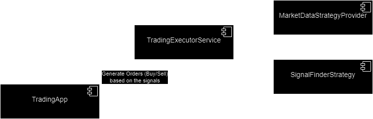

# RobotTrader

A trading application implemented in Scala 3 using ZIO, Doobie, and MySQL. This application periodically executes trading strategies and manages accounts and positions in a JDBC Compatible Database by default using MySQL database.

## Table of Contents
- [Features](#features)
- [Prerequisites](#prerequisites)
- [Installation](#installation)
- [Configuration](#configuration)
- [Usage](#usage)
- [Trading Strategies](#trading-strategies)
- [Contributing](#contributing)
- [License](#license)

## Features
- Periodic execution of trading strategies.
- Management of accounts, positions, and orders.
- Integration with MySQL database.
- Implementation of two trading strategies: Gap and MACD.

## Prerequisites
- JDK 11 or later
- Scala 3
- sbt (Scala Build Tool)
- JDBC Compatible DB (MySQL database by default)

## Installation
1. **Clone the repository:**
   ```sh
   git clone https://github.com/jorgegfx/RobotTrader.git
   cd RobotTrader
2. Set up the MySQL database:
Create a database and update the src/main/resources/application.conf file with your database configuration.
    ```sql
    CREATE DATABASE trading;
    CREATE USER 'trading_user'@'localhost' IDENTIFIED BY 'password';
    GRANT ALL PRIVILEGES ON trading.* TO 'trading_user'@'localhost';
    FLUSH PRIVILEGES;
3. Run the application:
    ```sh
    sbt run
## Configuration
The application uses HOCON configuration format. Update the src/main/resources/application.conf file with your database and application settings.
```hocon
{
  dataBaseConfig = {
    url = "jdbc:mysql://localhost:3306/robot_trading"
    user = "trading"
    password = "trading"
    driver = "com.mysql.cj.jdbc.Driver"
  }
  strategyConfigurations = {
    macd = {
        snapshotInterval = "OneMinute"
    }
    openGap = {
        signalCount = 1
    }
  }
  tradingMode = IntraDay
  stopLossPercentage = 10
  screenCount = 20
}
```
## Trading Strategies
### Gap Strategy
The Gap trading strategy identifies gaps between the closing price of the previous day and the opening price of the current day. It executes trades based on the size of the gap.

### MACD Strategy
The MACD (Moving Average Convergence Divergence) strategy uses the difference between short-term and long-term exponential moving averages (EMAs) to generate buy and sell signals. It includes a signal line to identify trading signals.

## Architecture
The Trading App creates orders from the execution service that relies on the input and the signals in order to generate the orders 

- **TradingApp** Zio Application with the responsibility of running the trading executor service
- **TradingExecutorService** Zio Service that will generate the orders from the Market Data and the signals
- **MarketDataStrategyProvider** Generate the required strategy market data input 
- **SignalFinderStrategy** From the Market Data collected will calculate the Buy/Sell signals



## Contributing
Contributions are welcome! Please fork the repository and open a pull request to contribute.
